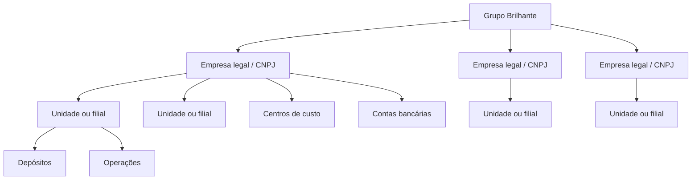

# Arquitetura-alvo do ERP Grupo Brilhante

## Objetivo

Este documento define como o aplicativo Base44 **Grupo Brilhante** será evoluído para atender o roteiro do ERP industrial sem perder os fluxos herdados da lavanderia. A implementação será incremental, auditável, multiempresa e segura por padrão. Integrações bancárias, fiscais, de mensageria e de folha permanecerão desativadas enquanto não houver credenciais, homologação e autorização de publicação.

## Alternativas consideradas

| Abordagem | Vantagens | Riscos e limitações | Custo relativo | Complexidade inicial |
|---|---|---|---|---|
| Evolução Base44 nativa | Máximo reaproveitamento de telas, entidades, IA, CRM, estoque, produção, financeiro e logística; menor tempo até a primeira homologação | Transações entre múltiplas entidades exigem state machines, idempotência e compensação explícitas | Menor | Média |
| Núcleo transacional externo com Base44 como experiência operacional | Maior controle sobre transações financeiras/fiscais, filas, backup e observabilidade | Duplica contratos, autenticação e operação; exige infraestrutura e sincronização adicional | Maior | Alta |

O repositório continuará compatível com a primeira alternativa, solicitada para este aplicativo, mas os adaptadores de banco, fiscal, folha e migração serão desacoplados para permitir migração futura de componentes críticos sem reescrever a interface.

## Princípios obrigatórios

| Princípio | Aplicação no código |
|---|---|
| Multiempresa explícita | Todo registro operacional crítico referencia `legal_entity_id`; unidades continuam representando locais físicos e passam a pertencer a uma empresa legal |
| Escopo mínimo | Backend valida empresa, unidade e permissão antes de qualquer operação privilegiada; o frontend apenas reflete a decisão server-side |
| Falha segura | Ausência de secret, configuração, homologação ou política ativa retorna indisponibilidade/pendência; nunca simula sucesso |
| Idempotência | Comandos financeiros, fiscais, bancários, de estoque e migração exigem chave idempotente e rejeitam colisão de payload |
| Estado observável | Fluxos assíncronos persistem estado, tentativa, erro seguro, próxima tentativa e trilha de auditoria |
| Compensação explícita | Operações multi-entidade registram checkpoints; falha parcial gera estado `repair_required`, sem retry cego |
| IA assistiva | IA pode extrair, classificar e sugerir; criação de obrigação, baixa financeira, emissão fiscal e movimentação definitiva exigem regra e autorização |
| Integrações desacopladas | Banco do Brasil, Focus NFe, DP, WhatsApp, Meta e demais provedores usam contratos próprios e secrets de ambiente |
| Migração rastreável | Cada registro importado preserva origem, identificador legado, hash, lote, resultado e reconciliação |
| Compatibilidade incremental | Schemas antigos continuam válidos; novos vínculos são opcionais durante migração e tornam-se obrigatórios por gate de implantação |

## Camadas

| Camada | Responsabilidade | Artefatos principais |
|---|---|---|
| Experiência | Dashboards, cadastros, CRM, contratos, operações, financeiro, fiscal e relatórios | React/Vite, páginas e componentes existentes |
| Autorização | Sessão, papéis, políticas, MFA, empresa, unidade e permissão | `functionSecurity.js`, `AccessPolicy`, `User`, novos helpers de escopo empresarial |
| Domínio | Regras de contratos, OS, compras, estoque, hospitalar, enxovais e limpeza | Funções server-side específicas, sem regra crítica no navegador |
| Contabilidade operacional | Contas, parcelas, caixa, alocações, conciliação, centros de custo e intercompany | Entidades financeiras existentes e novos vínculos multiempresa |
| Integrações | Banco, fiscal, folha, mensagens, documentos e APIs | Adaptadores com homologação, assinatura, timeout, retentativa e idempotência |
| Assíncrona | Eventos, filas, jobs e reparos | `ProcessedEvent`, `AIJob`, novos `IntegrationJob` e `RepairTask` |
| Auditoria e observabilidade | Ações, mudanças, erros, exportações e indicadores de saúde | `AuditLog`, eventos de domínio e painel de integração |

## Modelo organizacional

`LegalEntity` representa a pessoa jurídica. `Unit` permanece como local operacional e recebe `legal_entity_id`. `CostCenter`, `BankAccount` e `Warehouse` pertencem à empresa legal e podem ser vinculados a uma unidade.

## Consistência de comandos críticos

Cada comando crítico seguirá a sequência:

1. autenticar e validar estado da conta;
2. validar permissão, empresa e unidade;
3. normalizar payload e calcular `payload_hash`;
4. procurar `ProcessedEvent` pela chave idempotente;
5. rejeitar a mesma chave com payload diferente;
6. criar evento `processing` com checkpoints vazios;
7. executar mutações em ordem determinística;
8. persistir cada checkpoint concluído;
9. concluir como `completed` ou marcar `repair_required`;
10. auditar ator, entidade, empresa, unidade e resultado.

Retries só podem retomar a partir de checkpoints comprovados. Operações financeiras nunca devem reconstruir valores exclusivamente do estado atual quando um snapshot do comando estiver disponível.

## Contrato de integrações externas

| Estado | Significado | Pode produzir efeito real? |
|---|---|---|
| `disabled` | Sem configuração ou explicitamente desligada | Não |
| `configured` | Secrets presentes, sem teste de homologação | Não |
| `homologation` | Ambiente de teste autorizado | Somente sandbox do provedor |
| `approved` | Cenários de homologação aprovados | Ainda não, até promoção |
| `production` | Ativada por empresa legal após confirmação | Sim |
| `suspended` | Bloqueada por erro, incidente ou decisão operacional | Não |

A configuração é por `legal_entity_id`. Nenhum endpoint pode inferir empresa a partir de fallback hardcoded. Secrets nunca são persistidos em entidades ou retornados ao frontend.

## Dados e compatibilidade

Durante a primeira onda, registros herdados sem `legal_entity_id` continuam legíveis, mas operações novas exigem contexto empresarial. Um assistente de migração atribuirá empresa e centro de custo em lotes auditados. O go-live de cada CNPJ só ocorre quando o validador apontar cobertura empresarial completa e zero registros críticos órfãos.

## Segurança

Papéis administrativos não recebem acesso global por conveniência. Acesso consolidado exige `companies.view_all`; administração de empresa exige `companies.manage`; dados financeiros, fiscais, bancários e de folha possuem permissões distintas. MFA é obrigatório para operações críticas quando a política empresarial estiver ativa. Falha ao validar política bloqueia a operação server-side.

Widgets públicos usam sessão curta assinada, token de conversa e rate limit. O identificador de conversa isolado nunca autoriza leitura ou escrita. Webhooks exigem assinatura ou token de provedor em cabeçalho com comparação em tempo constante; secrets em query string não são aceitos.

## Gate de promoção

Uma onda só pode ser promovida quando build, lint direcionado, empacotamento de funções, validadores cumulativos e testes determinísticos passarem. Merge e publicação permanecem separados. Integrações reais, migração final, mensagens, pagamentos e emissão fiscal exigem confirmação explícita antes de qualquer execução.
